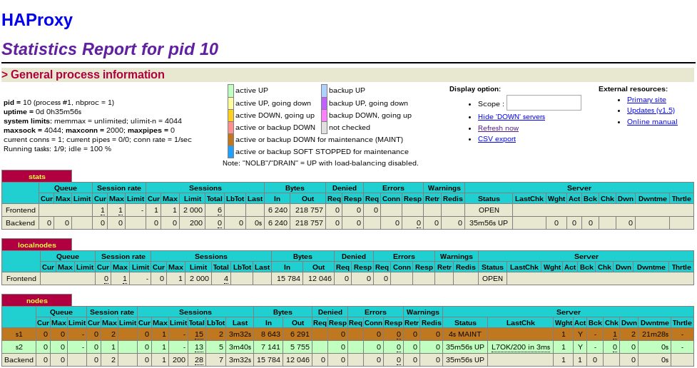

## Lab 03 - Load balancing
_Authors : Nair Alic & Adam Zouari_

### Introduction

...


### Task 1: Install the tools

**We already had installed the tools in others course so we had directly launch the docker-compose and we verified that we have 3 running containers :**


**The containers are connected by a network bridge :**


**We can now navigate to the address of the load balancer : **


**Deliverables:**

1. Explain how the load balancer behaves when you open and refresh the URL <http://192.168.42.42> in your browser. Add screenshots to complement your explanations. We expect that you take a deeper a look at session management.
	
	**When we open the URL a first time, the server `s1` respond with `gfGB....` as the session ID.**
	
	
	
	**After a refresh, it's now the server `s2` who respond with another session ID.**
	
	
	
	**At each request the sessionID changes. The load balancer seems not to care about the session management and use a Round Robin (One request per server in a uniform rotation) schedule policy to determine to which server a request should be sent.**

2. Explain what should be the correct behavior of the load balancer for session management.
	
	**The second request also should been handled by server `s1`, the `id` should have been the same as the first resquest and the `sessionViews` should have been incremented. **

3. Provide a sequence diagram to explain what is happening when one requests the URL for the first time and then refreshes the page. We want to see what is happening with the cookie. We want to see the sequence of messages exchanged (1) between the browser and HAProxy and (2) between HAProxy and the nodes S1 and S2. Here is an example:

  
  ** TODO**

4. Provide a screenshot of the summary report from JMeter.

	**Wee that the load is uniformly distributed between the two servers. **
	
	

5. Run the following command:

  ```bash
  $ docker stop s1
  ```

  Clear the results in JMeter and re-run the test plan. Explain what is happening when only one node remains active. Provide another sequence diagram using the same model as the previous one.

  **Obviously after stop the server `s1`, all requests are handled by the second server `s2`.**

 

 ** Therefore, after a refresh, the server remember that a request with thissession ID have already been made so the `sessionViews` is correctly incremented.**

 

### Task 2: Sticky sessions

It's time to go further. At this stage, we now have a load balanced web application but the session management is totally messed up. In this task your job is to fix the configuration of HAProxy to enable sticky session management.

For that, you will have to play with docker a little bit more. You might want to consult the file [Docker quick reference](Docker quick reference.md) for some useful commands and hints.

**Deliverables:**

1. There is different way to implement the sticky session. One possibility is to use the SERVERID provided by HAProxy. Another way is to use the NODESESSID provided by the application. Briefly explain the difference between both approaches (provide a sequence diagram with cookies to show the difference).</br>
**In the case of SERVERID, HAProxy will send the cookie in the first response. In the next request, the cookie will be sent by the client, and used by HAProxy to determine which server to forward the request. 
For NODESESSID, this is the application server which will send the cookie in the first response.**
  * Choose one of the both stickiness approach for the next tasks.</br>
    **For the next tasks we will use the SERVERID way.**

2. Provide the modified `haproxy.cfg` file with a short explanation of the modifications you did to enable sticky session management.</br>
</br>
**The blue line tells HAProxy to setup a cookie called SERVERID only if the user didn't come with suche one. In red, it provides the value of the cookie inserted by HAProxy to know which server to choose for this client. **
3. Explain what is the behavior when you open and refresh the URL <http://192.168.42.42> in your browser. Add screenshots to complement your explanations. We expect that you take a deeper a look at session management.</br>
</br>
**Now the session management seems to be correct. After a refresh we see that the value of `sessionViews` is 2 and the SERVERID cookie is set to s1.**

4. Provide a sequence diagram to explain what is happening when one requests the URL for the first time and then refreshes the page. We want to see what is happening with the cookie. We want to see the sequence of messages exchanged (1) between the browser and HAProxy and (2) between HAProxy and the nodes S1 and S2. We also want to see what is happening when a second browser is used.</br>
** TODO**

5. Provide a screenshot of JMeter's summary report. Is there a difference with this run and the run of Task 1?</br>
</br>
**The behaviour is the same that when we stopped one of the server. All request reach one of the server because they all use the same SERVERID.**

  * Clear the results in JMeter.

  * Now, update the JMeter script. Go in the HTTP Cookie Manager and <del>uncheck</del> <ins>verify that</ins> the box `Clear cookies each iteration?` <ins>is unchecked</ins>.

  * Go in `Thread Group` and update the `Number of threads`. Set the value to 2.

6. Provide a screenshot of JMeter's summary report. Give a short explanation of what the load balancer is doing.</br>
</br>
**Now the load balancer use the Round Robin algorithm to distribute uniformly the SERVERID between the request. That involves that the the request will be uniformly distribued but now with a notion of session. If a request with a SERVERID comes, it will be handled by the same server that the first time.**


### Task 3: Drain mode

HAProxy provides a mode where we can set a node to DRAIN state. In this case, HAProxy will let _current_ sessions continue to make requests to the node in DRAIN mode and will redirect all other traffic to the other nodes.

In our case, it means that if we put `s1` in DRAIN mode, all new traffic will reach the `s2` node and all current traffic directed to `s1` will continue to communicate with `s1`.

Another mode is MAINT mode which is more intrusive than DRAIN. In this mode, all current and new traffic is redirected to the other active nodes even if there are active sessions.

In this task, we will experiment with these two modes. We will base our next steps on the work done on Task 2. We expect you have a working Sticky Session configuration with two web app nodes up and
running called `s1` and `s2`.


**Deliverables:**

1. Take a screenshot of the Step 5 and tell us which node is answering.

	

	**Here we see that is the node s1 that answers.**
	
2. Based on your previous answer, set the node in DRAIN mode. Take a screenshot of the HAProxy state page.
	
	**To switch in drain mode our s1 node :**
	```bash
   $ socat - tcp:192.168.42.42:9999
   prompt
   
   > set server nodes/s1 state drain
   ```
   
   
   
   **Now we see that the status of s1 is DRAIN.**
   
3. Refresh your browser and explain what is happening. Tell us if you stay on the same node or not. If yes, why? If no, why?
	
	**After refreshing our browser, s1 still responding. That is because HAProxy will let current sessions continue to make requests to the node in DRAIN mode and will redirect all other traffic to the other nodes. **

4. Open another browser and open `http://192.168.42.42`. What is happening?
	
	**There is no change because the browser still have the cookie of the of the previous connection. s1 still responding.**

5. Clear the cookies on the new browser and repeat these two steps multiple times. What is happening? Are you reaching the node in DRAIN mode?
	
	**Now, when we clear the cookie we create a new session so all traffic will redirect to the other node s2. We don't reach the node in DRAIN mode.**

6. Reset the node in READY mode. Repeat the three previous steps and explain what is happening. Provide a screenshot of HAProxy's stats page.
	
	**To get back in READY mode : **
	
	```bash
	set server nodes/s1 state ready
	```
	**Now, HAProxy use RoundRobin to redirect the requests between the two nodes.**
	

	
7. Finally, set the node in MAINT mode. Redo the three same steps and explain what is happening. Provide a screenshot of HAProxy's stats page.
	**To switch in MAINT mode :**
	
	```bash
	set server nodes/s1 state ready
	```
	**Now, in MAINT mode, HAProxy will redirect ALL requests to the node s2. Even the current sessions wil be redirect to it and we will lose the session (counter restarted).**
	
	


### Task 4: Round robin in degraded mode.

In this part, we will try to simulate a degraded mode based on the round-robin previously configured.

To help experimenting the balancing when an application started to behave strangely, the web application has a REST resource to configure a delay in the response. You can set an arbitrary delay in milliseconds. Once the delay is configured, the response will take the amount of time configured.

To set the timeout, you have to do a `POST` request with the following
content (be sure the `Content-Type` header is set to
`application/json`. The configuration is applicable on each
node. Therefore, you can do one `POST` request on
`http://192.168.42.42/delay` and taking a look at the response cookies
will tell you which node has been configured.

```json
{
  "delay": 1000
}
```

The previous example will set a delay of 1 second.

Or retrieve the IP of the container you want to
configure and then do the `curl` command to configure the delay.

```bash
$ docker inspect <containerName>

$ curl -H "Content-Type: application/json" -X POST -d '{"delay": 1000}' http://<containerIp>:3000/delay
```

To reset the delay configuration, just do a `POST` with 0 as the delay
value.

Prepare your JMeter script with cookies erased (this will simulate new
clients for each requests) and 10 threads this will simulate 10
concurrent users.

*Remark*: In general, take a screenshot of the summary report in
 JMeter to explain what is happening.

**Deliverables:**

*Remark*: Make sure you have the cookies are kept between two requests.

1. Be sure the delay is of 0 milliseconds is set on `s1`. Do a run to have base data to compare with the next experiments.

	**To be sure that the delay are set on 0 on s1, we do a POST with 0 as the delay value.**
	
	
	
	**The following results will be a base to compare with the next experiments. **
	
	

2. Set a delay of 250 milliseconds on `s1`. Relaunch a run with the JMeter script and explain what it is happening?

	**Wee that the throughput is 10 times less than the base result. Therefore HAProxy still manage correctly the requests.**
	
	

3. Set a delay of 2500 milliseconds on `s1`. Same than previous step.
4. 
	**Now, with ad delay of 2500 ms on s1, it is totally unreachable. All requests are routed to s2. **
	
	

4. In the two previous steps, are there any error? Why?

5. Update the HAProxy configuration to add a weight to your nodes. For that, add `weight [1-256]` where the value of weight is between the two values (inclusive). Set `s1` to 2 and `s2` to 1. Redo a run with 250ms delay.

6. Now, what happened when the cookies are cleared between each requests and the delay is set to 250ms ? We expect just one or two sentence to summarize your observations of the behavior with/without cookies.

### Task 5: Balancing strategies

In this part of the lab, you will be less guided and you will have more opportunity to play and discover HAProxy. The main goal of this part is to play with various strategies and compare them together.

We propose that you take the time to discover the different strategies in [HAProxy documentation](http://cbonte.github.io/haproxy-dconv/configuration-1.6.html#balance) and then pick two of them (can be round-robin but will be better to chose two others). Once you have chosen your strategies, you have to play with them (change configuration, use Jmeter script, do some experiments).

**Deliverables:**

1. Briefly explain the strategies you have chosen and why you have chosen them.

**In the HAProxy documentation there are many different type of load balancing strategies. We've decided to choose these two :**

**first : This strategy is simple. The first server with available connections will receive the connection. They are chosen from the lowest to the highest ID. When the server reaches the "maxconn" value, the next server is used. But we have to be sure to set the "maxconn" setting if not, it doesn't make sense to use this strategy.**

**leastconn : In this case, the server with the lowest number of connections will receive the connection. If multiple servers may be chosen, round robin is performed to ensure to use them all at lease one time. This strategy is not very well recommended for short HTTP sessions. But in case of long sessions such as LDAP, SQL, etc. it's a quite good strategy. **

2. Provide evidences that you have played with the two strategies (configuration done, screenshots, ...)

**For both strategies, we have to change the configuration file "haproxy.cfg" in order to use it.  In the section "backend nodes",  you will find the balancing policy :** 


**As said, for the "first" strategy, we have to put a maxconn setting in order to have some results. For this you have to put in the section "global" the setting like this (We have tested with different maxconn values):**


**Here are the result for the "first" strategy :**


**We see that the connection goes always to server 1 (10 users and 100 loops here). We have tried several configurations on Jmeter and in the "maxconn" setting (here maxconn is 1). The S1 always respond, it never balance to S2. This solution is not adapted for our use. **


**For leastconn strategy, we have made few Jmeter load test and it seems to be a good load balancer. We have made two load test using cookies and not. The tests are made with 10 user and 100 loops.**

**Here are the results using the cookies :**


**We can see that the repartition is very good.**

**Here are the results when not using cookies :**


**Results are not bad at all. **

3. Compare the both strategies and conclude which is the best for this lab (not necessary the best at all).

**In comparison, we see that these two strategies are quite different. They have advantage and disadvantage. Before choosing one, we have to be sure what we want to do. The "first" strategy doesn't suit well for this lab, as we want to give charges on both server not only on one. So the best one between these two is the "leastconn" one, as we can see the results, the charges are well balanced between the two servers. **


### Conclusion

...


#### References

* [HAProxy Socket commands (drain, ready, ...)](https://cbonte.github.io/haproxy-dconv/configuration-1.5.html#9.2-set%20server)
* [Socat util to run socket commands](http://www.dest-unreach.org/socat/)
* [Socat command examples](https://stuff.mit.edu/afs/sipb/machine/penguin-lust/src/socat-1.7.1.2/EXAMPLES)

#### Lab due date

Deliver your results at the latest 15 minutes before class Wednesday, November 25.

#### Windows troubleshooting

git It appears that Windows users can encounter a `CRLF` vs. `LF` problem when the repos is cloned without taking care of the ending lines. Therefore, if the ending lines are `CRFL`, it will produce an error message with Docker:

```bash
... no such file or directory
```

(Take a look to this Docker issue: https://github.com/docker/docker/issues/9066, the last post show the error message).

The error message is not really relevant and difficult to troubleshoot. It seems the problem is caused by the line endings not correctly interpreted by Linux when they are `CRLF` in place of `LF`. The problem is caused by cloning the repos on Windows with a system that will not keep the `LF` in the files.

Fortunatelly, there is a procedure to fix the `CRLF` to `LF` and then be sure Docker will recognize the `*.sh` files.

First, you need to add the file `.gitattributes` file with the following content:

```bash
* text eol=lf
```

This will ask the repos to force the ending lines to `LF` for every text files.

Then, you need to reset your repository. Be sure you do not have **modified** files.

```bash
# Erease all the files in your local repository
git rm --cached -r .

# Restore the files from your local repository and apply the correct ending lines (LF)
git reset --hard
```

Then, you are ready to go.

There is a link to deeper explanation and procedure about the ending lines written by GitHub: https://help.github.com/articles/dealing-with-line-endings/
